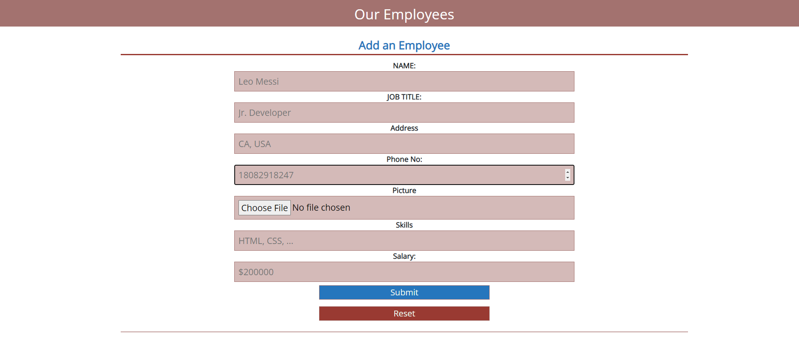
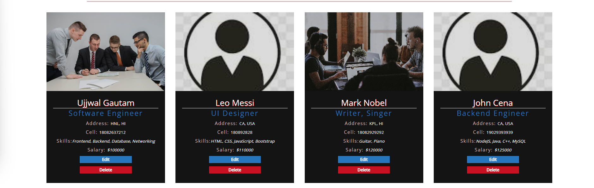
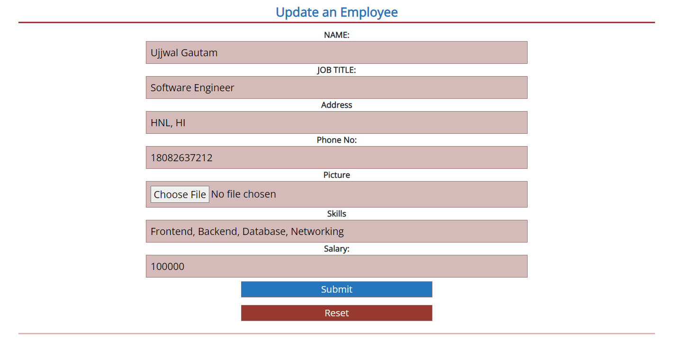

# Employee Tracker

## Installation

- Install NodeJS
- Clone the repository
- Go to the Server Folder and enter

```bash
     npm install && npm start
```

- Go to the Client Folder and enter

```bash
    npm install && npm start
```

    The application will be available at http://localhost:3000.

## Introduction

&nbsp; &nbsp; &nbsp; &nbsp; &nbsp; &nbsp; Employee-Tracker is a full stack application built to facilitate corporate to track their employees details. The application uses React on the front end and Express/NodeJS on the backend. The database used is MongoDB, with mongoose as a supporting library. The client-side use Redux for state management. This CRUD application uses API to create, read, update, and delete employee records.

## Technologies Used

1. Server

   - NodeJS
   - ExpressJS

2. Database

   - MongoDB
   - Mongoose

3. Client
   - React
   - Redux
   - Bootstrap

## User Guide

&nbsp; &nbsp; &nbsp; &nbsp; &nbsp; &nbsp; This is a single page application that doesn't use routing on the client side.

### Homepage

&nbsp; &nbsp; &nbsp; &nbsp; &nbsp; &nbsp; The homepage consists of form and list of employees. The employer can add, view, delete, and update employees from here.

### Add Employee



### View Employee



### Update Employee



## Contact Me

Employee-Tracker is designed, implemented, and maintained by [Ujjwal Gautam](mailto:ujjwalgautam00@gmail.com).
<br><br><br>

&copy; Employee-Tracker 2022, All rights reserved
